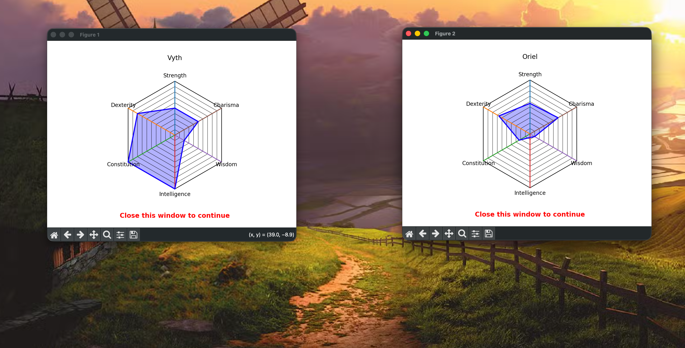
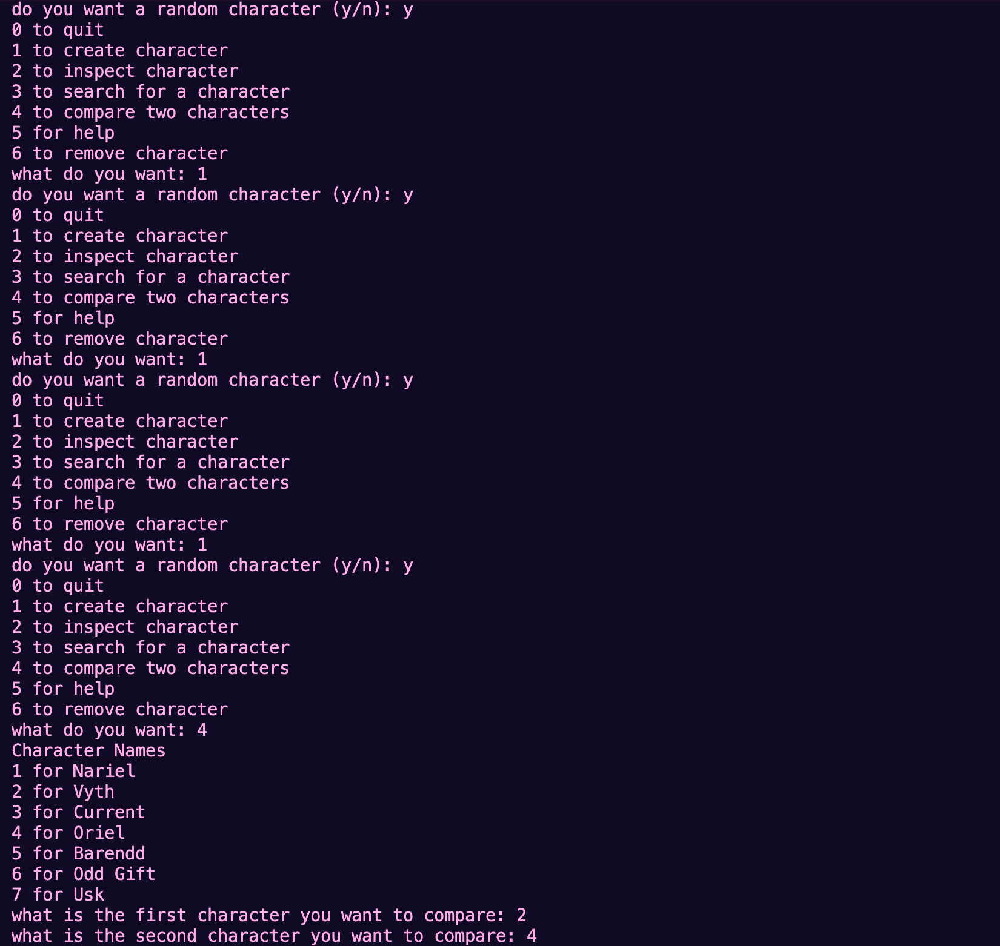

# Python DND manager (WIP)

The python dnd manager will hopefully solve all your dnd needs from storing characters to giving you ridicules items this program will (hopefully as I said it's a work in progress) solve.



## Setup
to set this up go to your terminal and type:
### Linix/MacOS
```bash
pip install -r requirements.txt
```
### Windows
```bash
python -m venv venv
source venv/bin/activate
pip install -r requirements.txt
```
## Usage
### Linix/MacOS
```bash
python main.py
```
### Windows
```bash
python main.py
```
## Contributing

Pull requests are welcome. For major changes, please open an issue first
to discuss what you would like to change.

## License

This is open source do what you will with it other than making money off of my hard work.